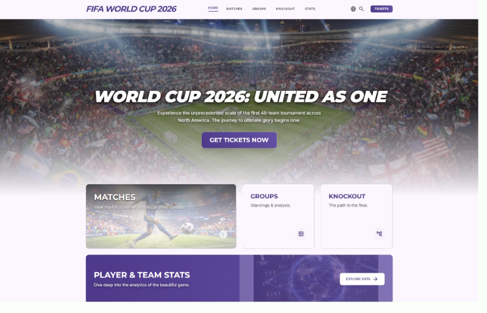

# 🏆 World Cup 2026 Web Grupo 4

¡Bienvenidos al repositorio oficial del proyecto **World Cup 2026**! Este desarrollo nace como respuesta a la petición del presidente de la federación de fútbol para crear una plataforma web moderna, interactiva y responsive que cubra todos los aspectos del próximo mundial, consumiendo datos en tiempo real.

Este proyecto ha sido desarrollado como parte del módulo **Frontend: JavaScript & APIs** en **Factoria 5**.

---

## 🚀 Enlaces del Proyecto

* **Repositorio GitHub:** [Enlace al repositorio](https://github.com/TU_USUARIO/TU_REPOSITORIO)
* **Despliegue en Vercel:** [Ver en Vercel](https://TU_PROYECTO.vercel.app)
* **GitHub Pages:** [Ver en GitHub Pages](https://TU_USUARIO.github.io/TU_REPOSITORIO)
* **Tablero de Gestión (GitHub Project):** [Ver Sprint Backlog](https://github.com/users/TU_USUARIO/projects/X)
* **Diseño en Figma:** [Ver Prototipo Figma](https://figma.com/...)

---

## 📋 Secciones de la Aplicación

La web está estructurada bajo una arquitectura semántica estricta (`<header>`, `<main>`, `<footer_>`) y cuenta con las siguientes 5 páginas o vistas principales:

1.  **🏠 Página de Bienvenida:** Portal principal de introducción al torneo, con una estética atractiva y accesos rápidos a las secciones clave de la web.
2.  **🗓️ Próximos Partidos y Resultados:** Agenda completa del torneo con sistema de filtrado dinámico según el estado del juego:
    * `Programados`: Próximos encuentros con fechas y horarios locales.
    * `En Vivo`: Partidos en tiempo real con marcadores actualizados.
    * `Finalizados`: Resultados definitivos de los encuentros concluidos.
    * `Todos`: Vista general de todo el calendario.
3.  **📊 Clasificación por Grupos:** Tabla de posiciones detallada de la fase de grupos en tiempo real (Puntos, PJ, PG, PE, PP, GF, GC, DG).
4.  **🌿 Árbol de Eliminatorias:** Cuadro interactivo visual que muestra el camino de las selecciones desde las fases de eliminación directa hasta la gran final.
5.  **👟 Estadísticas del Torneo:** Sección de analítica dividida en tres rankings principales:
    * *Máximos Goleadores* (Carrera por la Bota de Oro).
    * *Equipos Más Goleadores* (Poder ofensivo).
    * *Equipos con Más Goles Encajados* (Rendimiento defensivo).

---

## 🛠️ Tecnologías y Stack Utilizado

* **HTML5:** Estructura semántica avanzada y accesible.
* **CSS3 & Tailwind CSS / Bootstrap:** Estilos modernos, diseño de layouts (Flexbox/Grid) y total adaptabilidad móvil (Responsive Design).
* **Vanilla JavaScript (ES6+):** Manipulación dinámica del DOM, gestión de eventos y lógica de filtrado.
* **Fetch API:** Conexión e integración de datos en tiempo real utilizando la API de [Football-Data.org](https://www.football-data.org/).

---

## 📅 Planificación y Sprints

El proyecto se gestiona mediante metodologías ágiles utilizando **GitHub Projects**:

* **Sprint 1 (Viernes 10 de Julio):** Definición del diseño en Figma, estructura base HTML/CSS de las secciones, maquetación del árbol de eliminatorias y primeras conexiones de prueba con la API.
* **Sprint 2 & Entrega Final (Viernes 17 de Julio):** Implementación total de la lógica en JS, filtros dinámicos de partidos, renderizado de estadísticas, optimización de *Clean Code*, despliegues automáticos y corrección de bugs.

---

## ⚙️ Buenas Prácticas y Flujo de Trabajo

Para garantizar la calidad del código y una organización equitativa del equipo, seguimos estrictamente los siguientes estándares:

### Git Flow & Ramas (Conventional Branches)
* `main` / `master`: Código de producción completamente estable.
* `develop`: Rama de integración de características.
* Ramas de características basadas en el patrón: `feature/nombre-de-la-tarea`, `fix/issue-corregido`, o `docs/cambios-documentacion`.

### Historial de Commits (Conventional Commits)
Garantizamos un historial limpio y legible siguiendo la convención:
* `feat: add group classification tables`
* `fix: resolve active filter bug on schedule page`
* `style: implement responsive grid for statistics`
* `docs: update readme links`

### Clean Code
* Código JS modular, funciones con una única responsabilidad y nombres de variables autoexplicativos.
* Separación estricta de responsabilidades (Lógica de API separada de la manipulación del DOM).

---

## 📸 Captura de Pantalla del Resultado

*Nota: Reemplaza esta imagen con una captura real de la plataforma en la entrega final.*

---

## 👥 Equipo de Desarrollo

* **Carlos Javier Pérez Pérez** - *Frontend Developer* - [@TuGitHub](https://github.com/...)
* **Konstantin Mlechka** - *Scrum Master, UI/UX Designer & CSS Styles* - [@TuGitHub]([https://github.com/kvadrakola](https://github.com/kvadrakola))
* **Cristina Rodríguez López** - *Frontend Developer* - [@TuGitHub](https://github.com/...)
* **Margarita Bellido Ro** - *Frontend Developer* - [@TuGitHub](https://github.com/...)
* **José Loero Niele** - *Frontend Developer* - [@TuGitHub](https://github.com/...)
* **William Hernández** - *Scrum Msaster* - [@wfhgdev](https://github.com/...)
